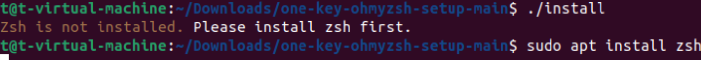
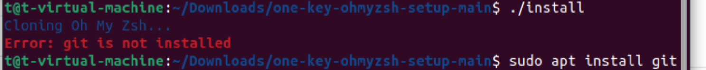

# 一键配置Oh My Zsh

## 简介
这是一个一键配置oh-my-zsh的项目，所谓的“一键”意思是只需要下载我们的仓库，利用极其短的步骤和时间，不需要其他教程，然后跟随我们运行脚本的提示就可以完成以下的配置:
|可获取的配置|
|---|
|zsh|
|oh-my-zsh框架|
|zsh-autosuggestions插件|
|zsh-syntax-highlighting插件|
|Powerline 字体|
### 项目的起因
项目设计的初衷旨在帮助您只需要花费极小的时间成本配置一个高效的终端助手，以此把您有限的时间投入到其它工作，提高工作效率，而不是像曾经的我们一样配置一个oh-my-zsh就耗费了一整个下午，我们希望您能够把时间花在其他对您而言更有意义或者说更重要的事情上，而不是这种配置工具的小事上。
## 使用方法
#### I.先决条件

<strong>您需要先安装git，以便克隆我们的仓库</strong>

#### II.使用步骤
<ol>
    <li>
    <code>git clone https://github.com/BITLucyHe/one-key-ohmyzsh-setup</code>
    </li>
    <li><code>chmod +x install</code>
    </li>
    <li>
    接下来您只需重复执行命令<code>./install</code>(大约3~4次，会因您的不同配置而有所不同)，如果小于我们预估的次数，您也不必慌张，直到出现类似以下界面
    有一个箭头的标志外观终端，那是我们为您设置的默认配置。
    </li>
</ol>

## 示例
<ol>
    <li>
    在安装了git的情况下，第一次执行命令<code>./install</code>
    </li>
    <li>
    在您输入密码后，您的<strong>终端会重启</strong>，不必惊慌，这是因为下载了zsh并且运行命令配置其为默认后，需要重启才能使得zsh为您的默认终端。
     您的终端在重新启动后大概是这样
    
    当您键入命令<code>echo $SHELL</code>应该会出现含有<code>zsh</code>的结果，如果不是，请您继续执行<code>./install</code>直到出现结果
    </li>
    <li>
    接着继续再次执行命令<code>./install</code>，会出现以下结果
    您的oh-my-zsh框架配置完成!
    </li>
    <li>
    接着为您配置插件和字体，再次<code>./install</code>
    
    </li>
    <li>重新开启终端
    <strong>您的终端配置完成了！恭喜!</strong>
    </li>
</ol>

## 贡献指南
您有问题就在评论区提建议或者提交request，我们都会查看的

## 作者和致谢
作者：BITLucyHe 和 potatotomatoes，我们只是站在巨人的肩膀上，利用一些基础的shell知识，帮助大家配置oh-my-zsh罢了，oh-my-zsh不是我们构建的，如需详细了解oh-my-zsh，请看[官方网站](https://github.com/ohmyzsh/ohmyzsh>https://github.com/ohmyzsh/ohmyzsh)

## 联系方式
BITLucyHe的邮箱: <lucy@bit.edu.cn>
